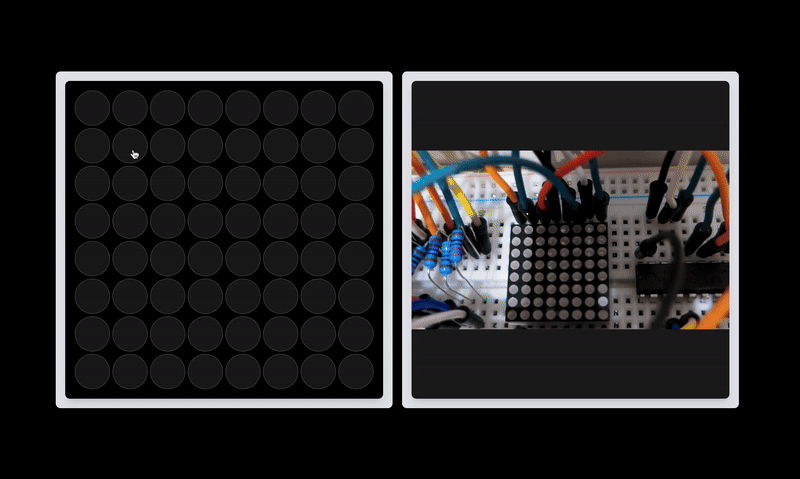

# 💡 upnepa

Welcome to **upnepa**, the finest (and possibly only) solution for remotely controlling LEDs to mimic the unpredictable, legendary Nigerian power supply system. Inspired by the cry of "Up NEPA!" whenever the lights come on, this project aims to bring that *authentic* experience right to your fingertips - no small gen required.

Head over to [upnepa.live](https://upnepa.live/) to begin relieving your trauma now!

## 🖊 Table of Contents

1. [What is Up NEPA?](#what-is-up-nepa)
2. [Why Should You Care?](#why-should-you-care)
3. [Features](#features)
4. [Demo](#demo)
5. [Contributing](#contributing)
6. [FAQ](#faq)

## ❓ What is Up NEPA?

**upnepa** is a Raspberry Pi-based LED control application. It allows you to:
- Remotely toggle LEDs.
- Experience the thrill of enjoying light for 2 seconds before it is forcibly taken away.

## 💡 Why Should You Care?

1. **Why Not?**: Give me a good reason why you shouldn't care. 
2. **Relive Childhood Joys**: Remember shouting "Up NEPA!" with uncontainable excitement? Relive it every day!
3. **Control Freaks Unite**: Want to show your friends you can control lights from your phone? You’re their hero now.

## 🚀 Features

- **64 LEDs**: Because you deserve options.
- **Remote Control**: Forget standing up. Control the LEDs from anywhere.
- **64 LEDS**: Did I mention 64 LEDS???

## 📸 Demo

## 🤝 Contributing

Feel free to:
- Report and fix bugs (there are so many of them)
- Add features like **random power outages** for *extra authenticity*.

## ❓ FAQ

**Q: Is this a joke?**  
A: Only when it’s not working.

**Q: Can this actually control my home’s power supply?**  
A: No, but that's a great idea. Submit a PR.

**Q: What happens if NEPA takes the light?**  
A: The LEDs turn off. What else?

## 🏆 License

This project is licensed under the "I Really Don't Care" License. For actual terms, see `LICENSE`.

